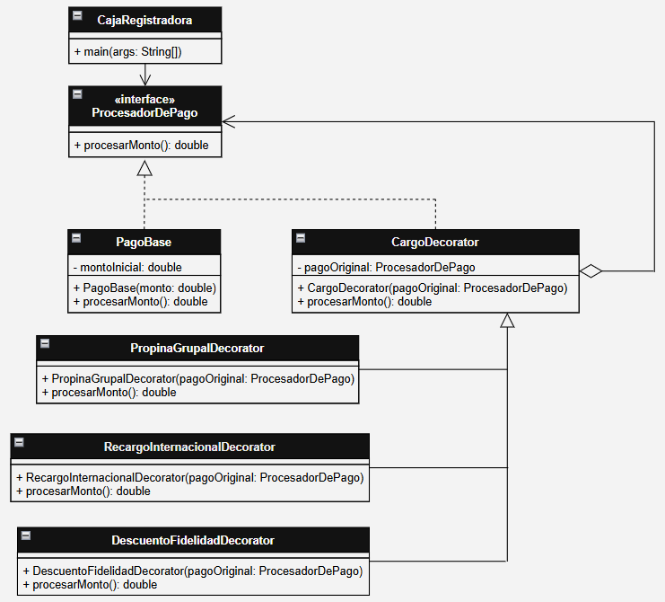

# ☕ ModularCoffee - Pasarela de Pagos Dinámica

Sistema de cobros modular para una tienda de café, implementado utilizando el patrón de diseño estructural **Decorator**.

---
## 🛠️ Alumno: Castillo Otiniano Diego Eduardo

---

## 📋 1. Descripción del Problema
En la operación diaria de la tienda de café, el cálculo del monto a cobrar en un ticket no es estático. El precio base puede verse alterado por múltiples factores comerciales y operativos apilables que no siempre ocurren de forma simultánea:
- **Propina automática del 10%** aplicable a pedidos de grupos grandes.
- **Recargo fijo de $2.00** por el procesamiento con tarjetas de crédito internacionales.
- **Descuento del 15%** vinculado al programa de fidelidad del cliente.

### ¿Por qué la herencia simple falla aquí?
Si intentáramos resolver este escenario mediante herencia tradicional, tendríamos una explosión combinatoria de clases (ej. `PagoConPropina`, `PagoConPropinaYDescuento`, `PagoConRecargoYDescuento`, etc.), volviendo el código inmanteniable. Además, el orden matemático de aplicación de los cargos importa, y la herencia estática no permite modificar comportamientos en tiempo de ejecución.

---

## 💡 2. Solución Elegida y Justificación
Se implementó el patrón de diseño **Decorator**, el cual permite añadir responsabilidades u operaciones de manera dinámica a un objeto envolviéndolo en sucesivas capas de objetos decoradores que comparten la misma interfaz.

### Justificación de la Elección:
1. **Apilamiento Dinámico:** Permite envolver el `PagoBase` con las capas exactas que requiera la venta en tiempo de ejecución (ej. Tarjeta Internacional + Propina Grupal).
2. **Principio Abierto/Cerrado (OCD - SOLID):** Si la cafetería introduce un nuevo cargo en el futuro (como un impuesto por empaque ecológico), se puede crear un nuevo decorador sin alterar una sola línea de código existente en el componente base.
3. **Control del Orden de Operaciones:** El orden en que el cliente (`CajaRegistradora`) anida los decoradores determina de forma precisa el orden matemático de los cálculos.

---

## 🗺️ 3. Diagrama Arquitectónico (UML)
El diseño sigue estrictamente la estructura del patrón Decorator, asegurando la delegación de responsabilidades a través de la variable `pagoOriginal`.



---

## 📁 4. Estructura del Proyecto
El código fuente está modularizado en paquetes limpios que separan responsabilidades:

```text
/cafeteria-pagos-decorator
├── README.md
├── /docs
│   └── diagrama_decorator.png
└── /src
    ├── /component
    │   ├── ProcesadorDePago.java
    │   └── PagoBase.java
    ├── /decorator
    │   ├── CargoDecorator.java
    │   ├── PropinaGrupalDecorator.java
    │   ├── RecargoInternacionalDecorator.java
    │   └── DescuentoFidelidadDecorator.java
    └── /client
        └── CajaRegistradora.java
```
---
## ▶️ 5. Salida Esperada
```text
Monto base del ticket: $10.0
Total Caso 1: $10.0

Monto base del ticket: $50.0
 + Recargo tarjeta internacional: $2.0
 + Propina grupal (10%): $5.2
Total Turistas: $57.2

Monto base del ticket: $20.0
 + Recargo tarjeta internacional: $2.0
 - Descuento fidelidad (15%): -$3.3
Total VIP: $18.7
```

